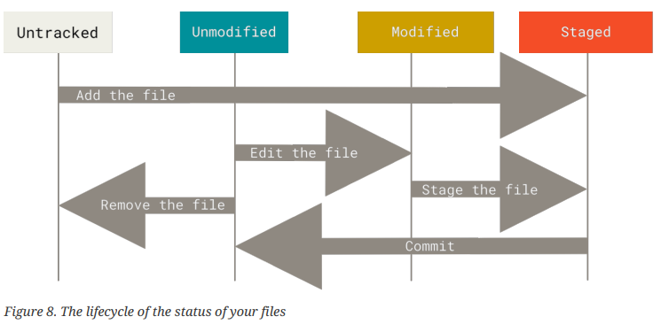

# Git Basics

## Getting a Git Repository

You typically obtain a Git repository in one of two ways:

1. You can take a local directory that is currently not under version control, and turn it into a Git repository.
2. You can *clone* and existing Git repository from elsewhere.

In either case, you end up with a Git repository on your local machine, ready for work.

### Initializing a Repository in an Existing Directory

If you have a project directory that is currently not under version control and you want to start controlling it with Git, you first need to go to that project's directory, and type:

```bash
git init
```

This creates a new subdirectory named `.git` that contains all of your necessary repository files - a Git repository skeleton. At this point, nothing in your project is tracked yet.

If you want to start version-controlling existing files (as opposed to an empty directory), you should probably begin tracking those files and do an initial commit. You can accomplish that with a few `git add` commands that specify the files you want to track, followed by a `git commit`:

```bash
git add *.c
git add LICENSE
git commit -m "Initial Project Version"
```
At this point, you have a Git repository with tracked files and an initial commit.

### Cloning an Existing Repository

If you want to get a copy of an existing Git repository, the command you need is `git clone`. Instead of just getting a working copy, Git receives a full copy of nearly all data that the server has. Every version of every file for the history of the project is pulled down by default when you run `git clone`. 

In fact, if your server disk gets corrupted, you can often use nearly any of the clones on any client to set the server back to the state it was in when it was clone (you may lose some server-side hooks and such, but all the versioned data will be there).

You clone a repository with `git clone <url>`.

```bash
git clone https://github.com/libgit2/libgit2
```

This creates a directory named `libgit2`, initializes a `.git` directory inside it, pulls down all the data for that repository, and checks out a working copy of the latest version.

If you want to clone the repository into a directory named something other than `libgit2`, you can specify the directory name as an additional argument:

```bash
git clone https://github.com/libgit2/libgit2 mylibgit2
```

This command does the same thing as the previous one, but the target directory is `mylibgit2`

## Recording Changes to the Repository

At this point, you should have a *bona fide* Git repository on your local machine, and a checkout or working copy of all of its files in front of you. Typically, you’ll want to start making changes and committing snapshots of those changes into your repository each time the project reaches a state you want to record.

Remember that each file in your working directory can be in one of two states: *tracked* or *untracked*. Tracked files are files that were in the last snapshot, as well as any newly staged files; they can be unmodified, modified, or staged. In short, tracked files are files that Git knows about.

Untracked files are everything else - any files in your working directory that were not in your last snapshot and are not in your staging area. When you first clone a repository, all of your files will be tracked and unmodified because Git just checked them out and you haven't edited anything.

As you edit files, Git sees them as modified, because you've changed them since your last commit. As you work, you selectively stage these modified files and then commit all those staged changes, and the cycle repeats.



### Checking the Status of Your Files

The main tool you use to determine which files are in which state is the `git status` command. If you run this command directly after a clone, you should see something like this:

```bash
$ git status
On branch master
Your branch is up-to-date with 'origin/master'.
nothing to commit, working tree clean
```

This means you have a clean working directory; in other words, none of your tracked files are
modified. Git also doesn’t see any untracked files, or they would be listed here. Finally, the
command tells you which branch you’re on and informs you that it has not diverged from the same branch on the server. For now, that branch is always master, which is the default; you won’t worry about it here.

Let's say you add a new file to your project, a simle README file. If the file didn't exist before, and you run `git status`, you see your untracked file.

You can see that your new README file is untracked, because it’s under the “Untracked files” heading in your status output. Untracked basically means that Git sees a file you didn’t have in the previous snapshot (commit), and which hasn’t yet been staged; Git won’t start including it in your commit snapshots until you explicitly tell it to do so.

It does this so you don’t accidentally begin including generated binary files or other files that you did not mean to include. You do want to start including README, so let’s start tracking the file.

### Tracking New Files

In order to begin tracking a new file, you can use the command `git add`. To begin tracking the README file, you can run this:

```bash
git add README
```
If you run your status command again, you can see that your README file is now tracked and staged to be committed.

You can tell that it’s staged because it’s under the “Changes to be committed” heading. If you
commit at this point, the version of the file at the time you ran git add is what will be in the
subsequent historical snapshot. You may recall that when you ran git init earlier, you then ran git
add <files> — that was to begin tracking files in your directory. The git add command takes a path
name for either a file or a directory; if it’s a directory, the command adds all the files in that
directory recursively.